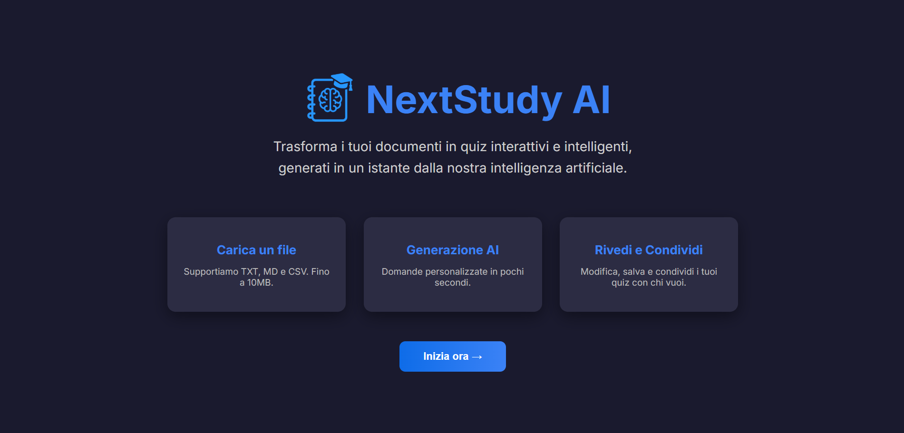

  
  

<h1 align="center">Hey, I'm AnouarVision 👋</h1>

  
  

<h3 align="center"> I'm studying Internet Technologies, with a strong focus on coding and a keen interest in cybersecurity </h3>

---

## About Me

- 🎓 I'm currently studying **Information Technology**
- 💻 Focused on **software development**, **cybersecurity** and **network infrastructure**
- 🕷️ In my free time, I analyze malware samples within secure, isolated environments. I believe that while curiosity can be risky, ignorance is often far more dangerous
- 🧪 I enjoy developing small tools and automation scripts to tackle repetitive or frustrating tasks, such as forensic scripting, packet filtering or monitoring suspicious behavior in virtual environments.
- 🌐 I believe in deep work and writing code that’s not just functional, but maintainable with a touch of paranoia in every script
---

## Interests

- 🖥️ Software Engineering
- 🧪 Malware Analysis & Digital Forensics
- 🔐 Network Security & Ethical Hacking
- 🧠 Reverse Engineering
- 🕶️ Human aspects of tech: social engineering, privacy, digital identity

---

## Languages & Tools

### Programming Languages

  
  
  
  
  

### Web Language & Technologies

  
  
  
  
  

### Frameworks & Libraries

  
  
  
  

### Tools & Platforms

  
  
  
  
  
  
  
  

### DevOps & Automation

  
  

### Operating Systems

  
  
  

---

## GitHub Stats

  
  

---

## Quote That Drives Me

> “Security is not a product, but a process.”
> — Bruce Schneier

---

## Let's Connect

- Reach me on Linkedin: www.linkedin.com/in/anouar-naouri-7826061b9
